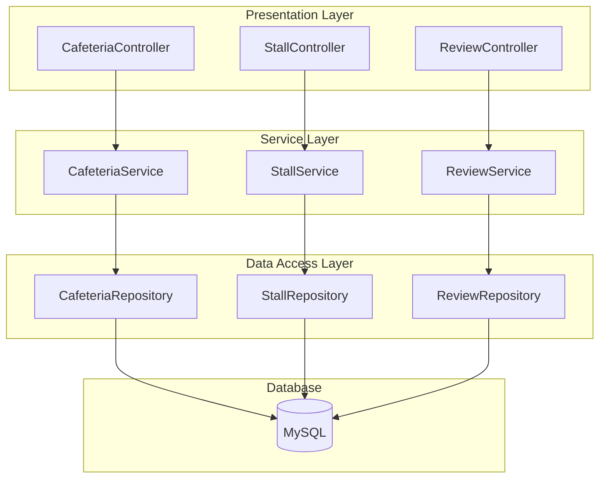

# nushungry-Backend

This is the backend for the NUSHungry application.


## System Architecture

The nushungry-Backend follows a classic three-tier architecture, commonly used in Spring Boot applications. This architecture separates the application into three logical and physical computing tiers: the presentation tier, the application tier, and the data tier.




- **Presentation Tier (Controllers)**: This is the top-most level of the application. The controllers handle HTTP requests, validate user input, and call the appropriate services. In this project, the controllers are: `CafeteriaController.java`, `ReviewController.java`, and `StallController.java`.
- **Application Tier (Services)**: The service layer contains the business logic of the application. It's responsible for processing data, performing calculations, and coordinating with the data access layer. The services in this project are: `CafeteriaService.java`, `ReviewService.java`, and `StallService.java`.
- **Data Tier (Repositories and Models)**: This tier is responsible for data persistence. The repositories are interfaces that provide a way to interact with the database, while the models are the Java objects that represent the data.
  - **Repositories**: `CafeteriaRepository.java`, `ReviewRepository.java`, `StallRepository.java`.
  - **Models**: `Cafeteria.java`, `Review.java`, `Stall.java`.


## Folder Structure

The project follows the standard Maven project structure:

```
nushungry-Backend
├── pom.xml
├── README.md
├── src
│   ├── main
│   │   ├── java
│   │   │   └── com
│   │   │       └── nushungry
│   │   │           ├── NushungryApplication.java
│   │   │           ├── config
│   │   │           │   ├── SecurityConfig.java
│   │   │           │   └── WebConfig.java
│   │   │           ├── controller
│   │   │           │   ├── CafeteriaController.java
│   │   │           │   ├── ReviewController.java
│   │   │           │   └── StallController.java
│   │   │           ├── model
│   │   │           │   ├── Cafeteria.java
│   │   │           │   ├── Review.java
│   │   │           │   └── Stall.java
│   │   │           ├── repository
│   │   │           │   ├── CafeteriaRepository.java
│   │   │           │   ├── ReviewRepository.java
│   │   │           │   └── StallRepository.java
│   │   │           └── service
│   │   │               ├── CafeteriaService.java
│   │   │               ├── ReviewService.java
│   │   │               └── StallService.java
│   │   └── resources
│   │       └── application.properties
│   └── test
└── target
```

------


## Dependencies

This project relies on several key dependencies to function correctly. Here are some of the most important ones:

- **Spring Boot Starter Web**: Provides all the necessary components for building a web application, including an embedded Tomcat server.
- **Spring Boot Starter Data JPA**: Simplifies data access using the Java Persistence API (JPA).
- **Spring Boot Starter Security**: Enables security features, allowing for authentication and authorization.
- **Spring Boot Starter Mail**: Sends transactional emails such as password reset verification codes.
- **MySQL Connector/J**: The official JDBC driver for MySQL.
- **Lombok**: A Java library that helps to reduce boilerplate code.
- **jjwt**: A Java library for creating and verifying JSON Web Tokens (JWTs).

------


## How to Start

### Prerequisites

- Java 17 or higher
- Maven
- MySQL


### Note: First-Time Setup - Database Initialization

If you are setting up this project for the first time, you must create the database and import the initial data.

1. Log in to MySQL:

   Open your terminal and log in to the MySQL server.

   ```bash
   mysql -u [your_username] -p
   ```

2. Create the Database:

   Create a new database for the application. We'll use nushungry_db as an example.

   ```sql
   CREATE DATABASE nushungry_db;
   ```

3. Import the Data:

   Import the provided SQL backup file (e.g., backup.sql) into the newly created database. Make sure the SQL file is in your current directory or provide the full path to it.

   ```bash
   mysql -u [your_username] -p nushungry_db < backup.sql
   ```

4. Configure Application:

   Ensure your src/main/resources/application.properties file is correctly configured to connect to this database.


### Running the Application

Once the database is set up, you can run the application.

1. Navigate to the `nushungry-Backend` directory.

2. Run the application using Maven:

   ```bash
   mvn spring-boot:run
   ```

3. The backend will be running on `http://localhost:8080`.

### Mail Setup

To enable password reset emails, configure SMTP credentials in `src/main/resources/application.properties` (or externalize them through environment variables):

```properties
spring.mail.host=smtp.example.com
spring.mail.port=587
spring.mail.username=your_email@example.com
spring.mail.password=your_email_password
spring.mail.properties.mail.smtp.auth=true
spring.mail.properties.mail.smtp.starttls.enable=true
password.reset.code.expiration-minutes=15
```

Replace the placeholder values with the credentials provided by your email service.


Of course. Here are the instructions for exporting the database, which have been added to the README file.


## Database Collaboration


To facilitate team collaboration and data synchronization, you can use the `mysqldump` utility to export and import the database.


### Exporting the Database

```bash
mysqldump -u [username] -p [database_name] > backup.sql
```

After executing the command, you will be prompted to enter your password. Upon success, a `backup.sql` file will be generated in the current directory.

**Example:**

```bash
mysqldump -u root -p nushungry_db > nushungry_db_backup.sql
```

## Password Reset API

- `POST /api/auth/forgot-password`: Accepts an email address, generates a six-digit verification code with a 15-minute expiration, persists it, and emails the code to the user.
- `POST /api/auth/reset-password`: Accepts email, verification code, and a new password; validates the code, updates the user's password, and marks the code as used.

Both endpoints are publicly accessible so that users can initiate password recovery without prior authentication.
