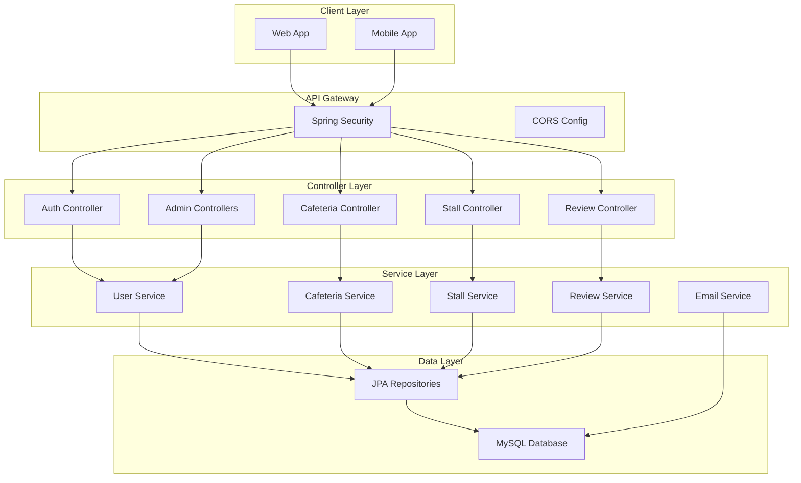
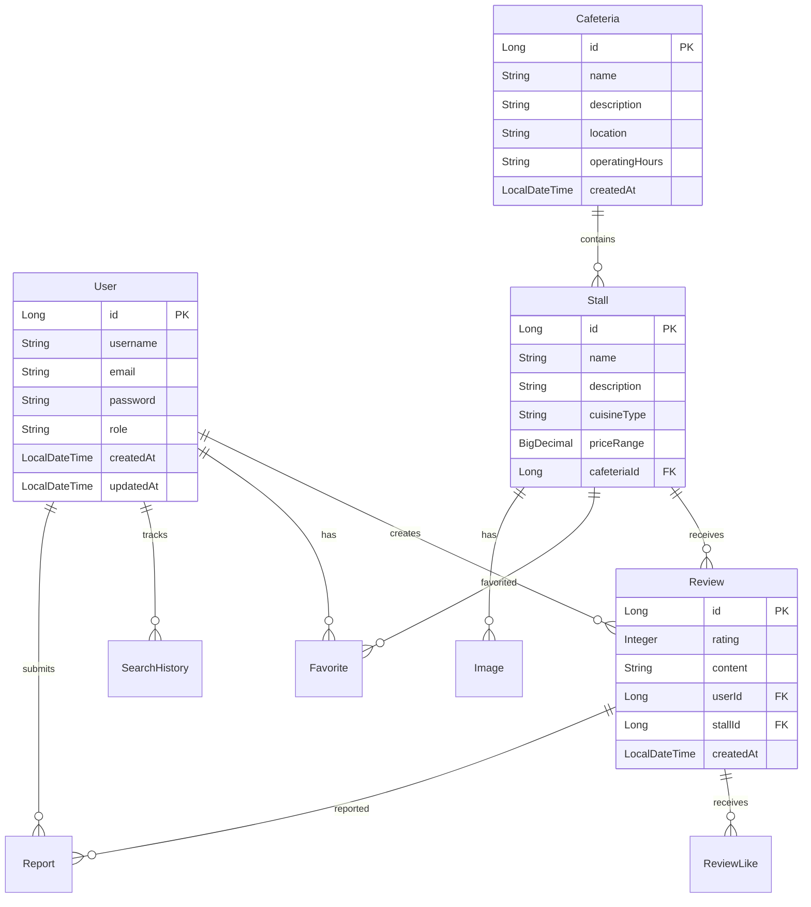

# NUSHungry Backend

[](https://github.com/SWE5006-Group-7/NUSHungry-Backend/actions)
[](https://github.com/SWE5006-Group-7/NUSHungry-Backend/actions)
[](https://openjdk.java.net/)
[](https://spring.io/projects/spring-boot)

A comprehensive Spring Boot backend service for the NUSHungry campus dining platform, built with modern Java practices and featuring complete CI/CD automation.

## 🏗️ System Architecture

This application follows a **monolithic architecture** with clean separation of concerns using a three-tier pattern:



### Architecture Highlights

- **Monolithic Design**: Single deployable unit with clear module boundaries
- **JWT Authentication**: Stateless authentication with refresh token support
- **Role-Based Access Control**: USER and ADMIN roles with method-level security
- **RESTful API**: Clean, intuitive API design following REST principles
- **Microservice-Ready**: Modular structure supports future microservice migration

## 📁 Project Structure

```
nushungry-backend/
├── 📄 pom.xml                           # Maven configuration
├── 📄 README.md                         # This file
├── 📄 Dockerfile                        # Docker containerization
├── 📁 .github/workflows/               # CI/CD pipelines
│   ├── 📄 ci.yml                        # Continuous Integration
│   └── 📄 cd.yml                        # Continuous Deployment
├── 📁 src/
│   ├── 📁 main/
│   │   ├── 📁 java/com/nushungry/
│   │   │   ├── 📄 NushungryApplication.java    # Main application class
│   │   │   ├── 📁 config/                      # Configuration classes
│   │   │   │   ├── 📄 SecurityConfig.java      # Spring Security config
│   │   │   │   ├── 📄 CorsConfig.java         # CORS configuration
│   │   │   │   └── 📄 FileStorageProperties.java
│   │   │   ├── 📁 controller/                 # REST API controllers
│   │   │   │   ├── 📄 AuthController.java      # Authentication endpoints
│   │   │   │   ├── 📄 CafeteriaController.java # Cafeteria management
│   │   │   │   ├── 📄 StallController.java     # Stall management
│   │   │   │   ├── 📄 ReviewController.java    # Review system
│   │   │   │   ├── 📄 UserController.java      # User management
│   │   │   │   ├── 📁 admin/                   # Admin-specific controllers
│   │   │   │   │   ├── 📄 AdminDashboardController.java
│   │   │   │   │   ├── 📄 AdminReportController.java
│   │   │   │   │   └── 📄 AdminUserController.java
│   │   │   │   ├── 📄 FavoriteController.java  # Favorites system
│   │   │   │   ├── 📄 SearchHistoryController.java
│   │   │   │   ├── 📄 ImageController.java     # Image handling
│   │   │   │   └── 📄 PasswordResetController.java
│   │   │   ├── 📁 model/                       # JPA entities
│   │   │   │   ├── 📄 User.java
│   │   │   │   ├── 📄 Cafeteria.java
│   │   │   │   ├── 📄 Stall.java
│   │   │   │   ├── 📄 Review.java
│   │   │   │   ├── 📄 Favorite.java
│   │   │   │   ├── 📄 Image.java
│   │   │   │   └── 📄 Report.java
│   │   │   ├── 📁 service/                     # Business logic layer
│   │   │   ├── 📁 repository/                  # Data access layer
│   │   │   ├── 📁 dto/                         # Data Transfer Objects
│   │   │   ├── 📁 filter/                      # Security filters
│   │   │   │   └── 📄 JwtAuthenticationFilter.java
│   │   │   └── 📁 util/                        # Utility classes
│   │   └── 📁 resources/
│   │       └── 📄 application.properties        # Application configuration
│   └── 📁 test/                                 # Test suite
│       ├── 📁 java/com/nushungry/
│       │   ├── 📄 IntegrationTestBase.java
│       │   └── 📁 controller/                  # Controller tests
│       └── 📁 resources/
└── 📁 target/                                  # Build output
```

## 🚀 Key Features

### 🔐 Authentication & Security
- **JWT Token-based Authentication** with refresh tokens
- **Role-based Access Control** (USER, ADMIN roles)
- **Password Reset System** with email verification
- **CORS Support** for cross-origin requests
- **BCrypt Password Encryption**

### 🏪 Core Functionality
- **Cafeteria Management**: Multi-location dining hall management
- **Stall Management**: Food stall and vendor management
- **Review System**: User ratings and reviews with moderation
- **Favorites System**: Personalized favorite stalls/items
- **Search & History**: Advanced search with history tracking
- **Image Upload**: Multi-format image handling with thumbnails
- **Reporting System**: User reporting and admin moderation

### 🛠️ Technical Features
- **Spring Boot 3.2.3** with Java 17
- **Spring Security** with JWT authentication
- **Spring Data JPA** with MySQL database
- **Swagger/OpenAPI 3.0** documentation
- **Comprehensive Test Suite** with JUnit 5
- **CI/CD Pipeline** with GitHub Actions
- **Docker Containerization** support
- **Email Service** integration
- **Image Processing** with thumbnail generation

## 📊 Database Schema

The application uses a relational MySQL database with the following core entities:



## 🛡️ Security Configuration

### Authentication Flow
1. **Login**: User provides credentials → JWT token + refresh token
2. **API Access**: JWT token sent in Authorization header
3. **Token Refresh**: Refresh token used to obtain new JWT
4. **Password Reset**: Email verification code system

### Authorization Matrix
| Endpoint | Public | User | Admin |
|----------|--------|------|-------|
| `GET /api/cafeterias/**` | ✅ | ✅ | ✅ |
| `GET /api/stalls/**` | ✅ | ✅ | ✅ |
| `GET /api/reviews/**` | ✅ | ✅ | ✅ |
| `POST /api/auth/**` | ✅ | ✅ | ✅ |
| `POST /api/reviews` | ❌ | ✅ | ✅ |
| `PUT /api/stalls/**` | ❌ | ❌ | ✅ |
| `DELETE /api/cafeterias/**` | ❌ | ❌ | ✅ |
| `/api/admin/**` | ❌ | ❌ | ✅ |

## 🔧 Configuration

### Environment Variables

```bash
# Database Configuration
SPRING_DATASOURCE_URL=jdbc:mysql://localhost:3306/nushungry_db
SPRING_DATASOURCE_USERNAME=your_username
SPRING_DATASOURCE_PASSWORD=your_password

# JWT Configuration
JWT_SECRET=your_super_secret_key
JWT_EXPIRATION=86400000

# Email Configuration (Gmail SMTP)
SPRING_MAIL_HOST=smtp.gmail.com
SPRING_MAIL_PORT=587
SPRING_MAIL_USERNAME=your_email@gmail.com
SPRING_MAIL_PASSWORD=your_app_password
```

### Application Properties

```properties
# Server Configuration
server.port=8080

# Database Configuration
spring.datasource.driver-class-name=com.mysql.cj.jdbc.Driver
spring.jpa.database-platform=org.hibernate.dialect.MySQLDialect
spring.jpa.hibernate.ddl-auto=update
spring.jpa.show-sql=true

# JWT Configuration
jwt.expiration=86400000

# Email Configuration
spring.mail.properties.mail.smtp.auth=true
spring.mail.properties.mail.smtp.starttls.enable=true

# Password Reset Configuration
password.reset.code.expiration-minutes=15
```

## 🚀 Getting Started

### Prerequisites

- **Java 17** or higher
- **Maven 3.6+**
- **MySQL 8.0+**
- **Git**

### Database Setup

1. **Create Database**
   ```sql
   CREATE DATABASE nushungry_db CHARACTER SET utf8mb4 COLLATE utf8mb4_unicode_ci;
   ```

2. **Import Initial Data** (optional)
   ```bash
   mysql -u username -p nushungry_db < backup.sql
   ```

### Running the Application

1. **Clone the Repository**
   ```bash
   git clone https://github.com/SWE5006-Group-7/NUSHungry-Backend.git
   cd NUSHungry-Backend
   ```

2. **Configure Database**
   ```bash
   # Edit src/main/resources/application.properties
   # Or set environment variables
   ```

3. **Build and Run**
   ```bash
   # Using Maven
   mvn clean install
   mvn spring-boot:run

   # Or using Java directly
   mvn clean package
   java -jar target/nushungry-backend-0.0.1-SNAPSHOT.jar
   ```

4. **Access the Application**
   - **API Base URL**: `http://localhost:8080`
   - **Swagger Documentation**: `http://localhost:8080/swagger-ui.html`
   - **OpenAPI Spec**: `http://localhost:8080/v3/api-docs`

### Docker Deployment

```bash
# Build Docker Image
docker build -t nushungry-backend .

# Run Container
docker run -p 8080:8080 \
  -e SPRING_DATASOURCE_URL=jdbc:mysql://host.docker.internal:3306/nushungry_db \
  -e SPRING_DATASOURCE_USERNAME=root \
  -e SPRING_DATASOURCE_PASSWORD=password \
  nushungry-backend
```

## 📚 API Documentation

### Authentication Endpoints

| Method | Endpoint | Description | Auth Required |
|--------|----------|-------------|---------------|
| POST | `/api/auth/login` | User login | No |
| POST | `/api/auth/register` | User registration | No |
| POST | `/api/auth/refresh` | Refresh JWT token | No |
| POST | `/api/auth/forgot-password` | Request password reset | No |
| POST | `/api/auth/reset-password` | Reset password | No |

### Cafeteria Endpoints

| Method | Endpoint | Description | Auth Required |
|--------|----------|-------------|---------------|
| GET | `/api/cafeterias` | List all cafeterias | No |
| GET | `/api/cafeterias/{id}` | Get cafeteria details | No |
| POST | `/api/cafeterias` | Create cafeteria | Admin |
| PUT | `/api/cafeterias/{id}` | Update cafeteria | Admin |
| DELETE | `/api/cafeterias/{id}` | Delete cafeteria | Admin |

### Stall Endpoints

| Method | Endpoint | Description | Auth Required |
|--------|----------|-------------|---------------|
| GET | `/api/stalls` | List all stalls | No |
| GET | `/api/stalls/{id}` | Get stall details | No |
| GET | `/api/stalls/cafeteria/{cafeteriaId}` | Get stalls by cafeteria | No |
| POST | `/api/stalls` | Create stall | Admin |
| PUT | `/api/stalls/{id}` | Update stall | Admin |
| DELETE | `/api/stalls/{id}` | Delete stall | Admin |

### Review Endpoints

| Method | Endpoint | Description | Auth Required |
|--------|----------|-------------|---------------|
| GET | `/api/reviews` | List reviews | No |
| GET | `/api/reviews/stall/{stallId}` | Get stall reviews | No |
| POST | `/api/reviews` | Create review | User |
| PUT | `/api/reviews/{id}` | Update review | User/Owner |
| DELETE | `/api/reviews/{id}` | Delete review | User/Owner/Admin |

## 🧪 Testing

### Test Coverage
- **Unit Tests**: Service layer business logic
- **Integration Tests**: Database operations and API endpoints
- **Security Tests**: Authentication and authorization
- **E2E Tests**: Complete user workflows

### Running Tests

```bash
# Run all tests
mvn test

# Run tests with coverage
mvn clean test jacoco:report

# Run specific test class
mvn test -Dtest=AuthControllerTest

# Run integration tests only
mvn test -Dtest=**/*IntegrationTest
```

### Test Results
Coverage reports are generated in `target/site/jacoco/index.html`

## 🔄 CI/CD Pipeline

### Continuous Integration (CI)
- **Build & Test**: Automated build and test execution
- **Code Quality**: SpotBugs static analysis
- **Security Scan**: OWASP dependency checking
- **Coverage Report**: JaCoCo code coverage
- **Container Scan**: Docker image security analysis

### Continuous Deployment (CD)
- **Docker Build**: Multi-stage Docker builds
- **ECS Deployment**: Amazon ECS container deployment
- **Health Checks**: Automated deployment verification
- **Rollback**: Automatic rollback on deployment failure

## 🛠️ Development

### Code Style
- **Java 17** features and conventions
- **Lombok** for reducing boilerplate code
- **Spring Boot** best practices
- **RESTful API** design principles

### Contributing
1. Fork the repository
2. Create a feature branch (`git checkout -b feature/amazing-feature`)
3. Commit your changes (`git commit -m 'Add amazing feature'`)
4. Push to the branch (`git push origin feature/amazing-feature`)
5. Open a Pull Request

## 🔍 Monitoring & Logging

### Application Logs
- **Level**: INFO, WARN, ERROR
- **Format**: Structured JSON logging
- **Rotation**: Daily log rotation with compression

### Health Checks
- **Actuator Endpoints**: `/actuator/health`, `/actuator/metrics`
- **Database Health**: Connection pool monitoring
- **JWT Health**: Token validation monitoring

## 🔧 Troubleshooting

### Common Issues

**Database Connection Issues**
```bash
# Check MySQL service
sudo systemctl status mysql

# Test connection
mysql -u username -p -h localhost nushungry_db
```

**JWT Token Issues**
- Verify JWT secret configuration
- Check token expiration settings
- Validate refresh token flow

**CORS Issues**
- Check allowed origins in SecurityConfig
- Verify frontend port configuration
- Ensure preflight OPTIONS requests are handled

## 📄 License

This project is licensed under the MIT License - see the [LICENSE](LICENSE) file for details.

## 🤝 Support

For support and questions:
- **Issues**: [GitHub Issues](https://github.com/SWE5006-Group-7/NUSHungry-Backend/issues)
- **Documentation**: [API Docs](http://localhost:8080/swagger-ui.html)
- **Email**: support@nushungry.com

---

**Built with ❤️ by the NUSHungry Team**